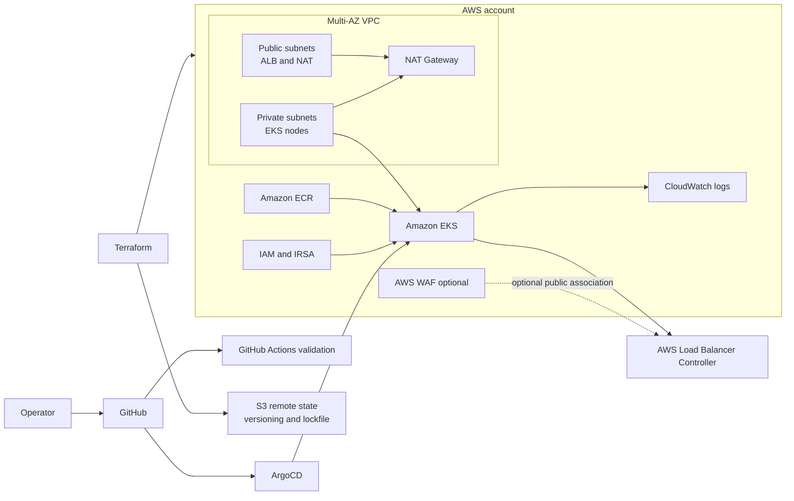

# AWS EKS Platform — Terraform, Kubernetes and GitOps

Production-oriented reference platform for running Kubernetes on Amazon EKS. The repository demonstrates modular infrastructure as code, private worker networking, workload identity with IRSA, declarative delivery with ArgoCD, security controls, observability foundations and cost-aware operations.

> Status: validated locally where tooling permits. No AWS infrastructure has been deployed or verified during the current repository hardening phase. Items that require an AWS account are explicitly marked as pending evidence.

## Architecture



The development defaults use EKS 1.35 in standard support, two Availability Zones, private managed node groups, one shared NAT Gateway for cost control, a private EKS API endpoint and an internal ALB. Public access, WAF and higher availability NAT are explicit opt-ins.

## Repository layout

```text
terraform/bootstrap/state/     Protected S3 remote-state bootstrap
terraform/environments/dev/    Environment composition and provider lock
terraform/modules/             VPC, ECR, EKS, IRSA and WAF modules
kubernetes/base/               Namespaces and RBAC
kubernetes/apps/               Application manifests
kubernetes/security/           Network policies
kubernetes/kustomization.yaml  Deployable Kustomize entry point
argocd/applications/            AppProject and Applications
argocd/bootstrap/              ArgoCD chart values
helm-values/                   Reviewed component defaults
.github/workflows/             Terraform, platform and security CI
scripts/                       Guarded operational workflow
docs/                          Architecture, security and runbooks
```

## Implemented controls

- EKS nodes in private subnets and private API access by default.
- All EKS control-plane log types with bounded CloudWatch retention.
- IRSA trust policies bound to exact namespace/service-account subjects, including VPC CNI.
- Explicit EKS Access Entry for an IAM role; implicit creator administration is disabled.
- IMDSv2-only nodes with a hop limit of one and encrypted gp3 root volumes.
- Scoped Secrets Manager access for External Secrets.
- Dedicated EBS CSI role and managed add-on integration.
- ECR scan-on-push, immutable tags and lifecycle policy.
- Restricted Pod Security Admission labels for application namespaces.
- Non-root workload, dropped capabilities, seccomp, read-only root filesystem and no service-account token mount.
- Default-deny NetworkPolicy, explicit ALB-source ingress and DNS egress.
- ArgoCD AppProject restrictions, automated self-heal and prune.
- CI checks for Terraform, YAML, shell, Kustomize, Helm, secrets and IaC security.

## Local validation

Required baseline tools are Terraform, kubectl, Helm, Git and jq. Optional local linters are ShellCheck and Yamllint.

```bash
./scripts/00-verify-tools.sh
./scripts/06-validate-local.sh
```

The validation workflow does not run `terraform plan`, contact AWS or create infrastructure. Provider installation during `terraform init -backend=false` requires access to the Terraform Registry unless the providers are already cached.

## Future AWS validation

Before planning, bootstrap the protected state bucket once, create the ignored `backend.hcl`, then create `terraform.tfvars`. Retain the small local bootstrap state securely.

```bash
terraform -chdir=terraform/bootstrap/state init
terraform -chdir=terraform/bootstrap/state plan -out=tfplan
# Apply requires explicit approval.

cp terraform/environments/dev/backend.hcl.example terraform/environments/dev/backend.hcl
cp terraform/environments/dev/terraform.tfvars.example terraform/environments/dev/terraform.tfvars
./scripts/01-terraform-init-plan.sh
terraform -chdir=terraform/environments/dev show tfplan
```

Only after peer review of the saved plan:

```bash
./scripts/02-terraform-apply.sh
./scripts/03-update-kubeconfig.sh
./scripts/04-bootstrap-platform.sh
```

These commands are documented for a future authorized session. They were not executed as part of local hardening.

## Security boundaries

- No static AWS or GitHub credentials belong in Git.
- Prefer AWS IAM Identity Center for operators and GitHub OIDC for future automation.
- Keep the public EKS endpoint disabled unless trusted `/32` CIDRs are supplied; a private endpoint requires an approved private network path.
- Public ingress requires a separate reviewed configuration with ACM TLS, HTTPS redirect and WAF association.
- Terraform plan and state files are ignored because they may contain sensitive values.

See [security design](docs/security/security-design.md) and [deployment guide](docs/operations/deployment-guide.md).

## Cost posture

The cluster is intended for short-lived portfolio validation. The main cost drivers are EKS control-plane hours, EC2 nodes, NAT Gateway hours/data, ALB hours/capacity, WAF, EBS and logs. WAF is disabled and Grafana is not installed by default; the dev topology starts with two `t3.medium` nodes total.

Before deployment, create a dated estimate using AWS Pricing Calculator and verify the selected Kubernetes version is in standard EKS support. EKS 1.35 was confirmed in standard support in `us-east-1` on 2026-07-21. See [cost control](docs/operations/cost-control.md).

## Destruction

Kubernetes-managed AWS resources must be removed and verified before Terraform destroys the VPC. ECR is configured for force deletion only in the ephemeral dev environment.

Follow [the destroy runbook](docs/operations/destroy-guide.md); do not treat `terraform destroy` as the first cleanup step.

## Evidence status

| Evidence | Status |
|---|---|
| Terraform formatting | Local validation available |
| Terraform initialization/validation | Passed locally for bootstrap and dev stacks |
| Kustomize render | Validated locally |
| Helm render | Enforced in CI; local repository access required |
| AWS identity and regional compatibility | Verified read-only on 2026-07-21 |
| AWS plan | Pending remote-state bootstrap and review |
| EKS, nodes, IRSA and add-ons | Pending AWS deployment |
| ArgoCD sync and ALB | Pending cluster deployment |
| Destruction/recovery | Pending controlled exercise |

## Interview focus

The key trade-offs are documented rather than hidden: shared NAT versus zonal resilience, private versus public control-plane access, IRSA boundaries, GitOps bootstrap sequencing, optional cost controls and the lifecycle of Kubernetes-created AWS resources. See [interview talking points](docs/interview/talking-points.md).
