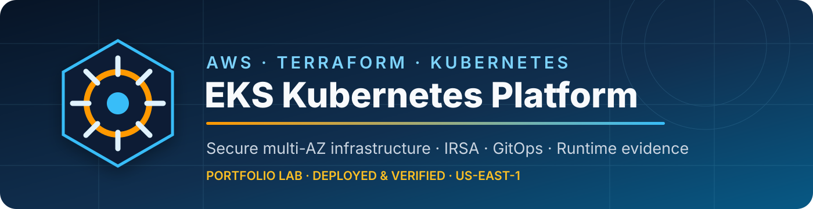
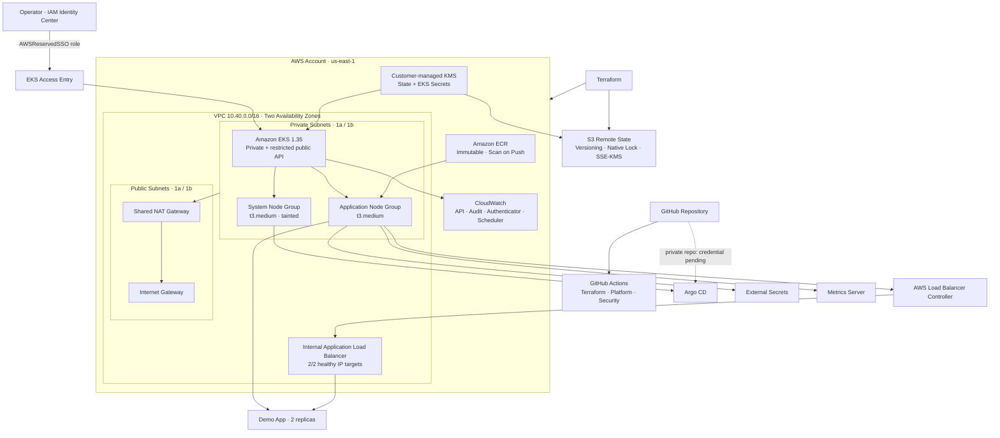
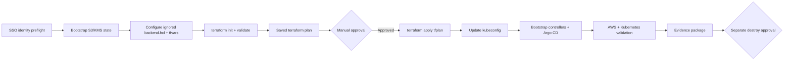
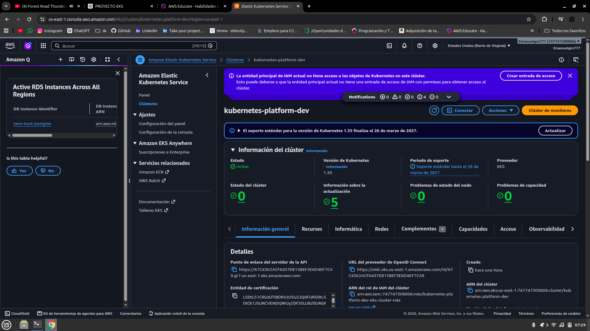
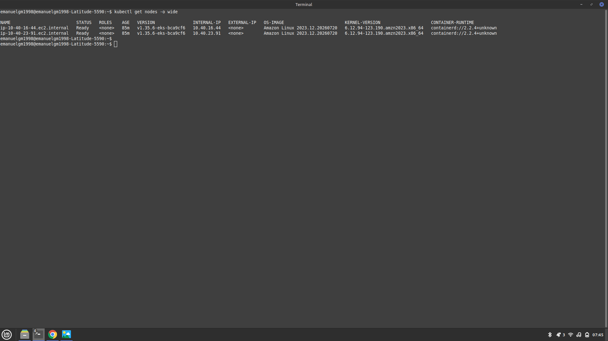
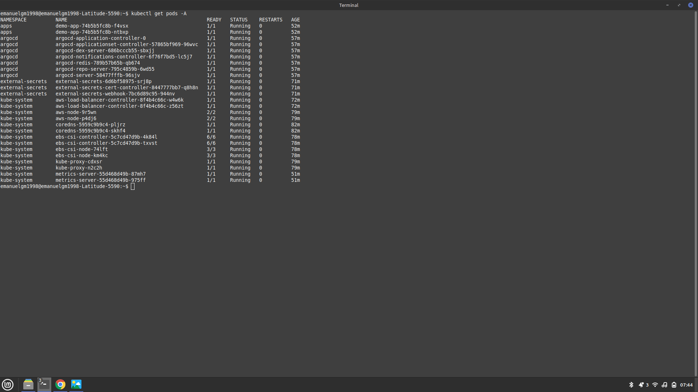

<p align="center">
  
</p>

<p align="center">
  <strong>A security-focused, multi-AZ Kubernetes platform on Amazon EKS, built with modular Terraform and validated with real runtime evidence.</strong>
</p>

<p align="center">
  <a href="terraform/environments/dev/provider.tf"></a>
  <a href="https://aws.amazon.com/eks/"></a>
  <a href="kubernetes/"></a>
  <a href=".github/workflows/terraform-ci.yml"></a>
  <a href=".github/workflows/security-ci.yml"></a>
  <a href="LICENSE"></a>
</p>

<p align="center">
  
  
  
  
  
</p>

---

## Overview

This repository is a portfolio-grade implementation of a short-lived AWS Kubernetes platform. It demonstrates the work expected from a Cloud, DevOps or Platform Engineer: remote state bootstrap, network design, EKS lifecycle, workload identity, GitOps, controller installation, security hardening, functional testing, cost control and auditable evidence.

The environment was deployed in `us-east-1` and verified on 2026-07-27. Terraform converged with **0 add / 0 change / 0 destroy / 0 replace** after deployment. Amazon EKS 1.35, both managed node groups, the four EKS add-ons, the internal ALB and all observed Kubernetes workloads reached healthy runtime states. The infrastructure remains active pending explicitly authorized destruction.

> [!IMPORTANT]
> This is a hardened **portfolio/dev laboratory**, not a claim of production readiness. The verified completion level is **94%**: demo GitOps reconciliation is blocked by private-repository authentication, and a real secret read is not applicable because the project defines no AWS Secrets Manager test secret.

## Architecture



The design separates system and application capacity, keeps worker nodes private, enables both private API access and a public endpoint restricted to the operator's observed `/32`, and uses an internal ALB for the demo workload. See the [architecture report](docs/evidence/ARCHITECTURE_REPORT.md) for the deployed topology and production gaps.

## Technology stack

| Layer | Technology | Verified implementation |
|---|---|---|
| Cloud | AWS, Amazon EKS 1.35 | Active control plane in `us-east-1` |
| Infrastructure as Code | Terraform 1.15, AWS provider 5.100 | Modular stacks, remote backend, zero drift |
| Networking | VPC, 4 subnets, IGW, NAT Gateway, ALB | Two AZs, private nodes, active routes |
| Compute | EKS managed node groups, Amazon Linux 2023 | 2 × `t3.medium`, both Ready |
| Identity | IAM Identity Center, IAM, EKS Access Entry | SSO role validated; implicit creator admin disabled |
| Workload identity | OIDC, IRSA | VPC CNI, EBS CSI, LBC and External Secrets roles |
| Encryption | AWS KMS, S3 SSE-KMS, encrypted gp3 | Separate rotating keys for state and EKS Secrets |
| Containers | Kubernetes, Kustomize, Helm | 26/26 observed pods Running/Ready |
| GitOps | Argo CD 3.4.5 | Platform healthy; Metrics Server Synced/Healthy |
| Platform services | AWS LBC, External Secrets, Metrics Server, EBS CSI | Deployed and runtime-validated |
| Observability | CloudWatch control-plane logs, Metrics API | Recent streams/events and live resource metrics |
| CI/CD security | GitHub Actions, Trivy, Gitleaks | Terraform, manifest and security workflows |
| Operating system | Linux, Amazon Linux 2023 | IMDSv2-required private worker nodes |

## AWS architecture

- **VPC and routing:** one `10.40.0.0/16` VPC across `us-east-1a` and `us-east-1b`, with two public `/24` subnets, two private `/22` subnets, an Internet Gateway and a shared NAT Gateway.
- **Amazon EKS:** Kubernetes 1.35 with API, audit, authenticator, controller-manager and scheduler logging. Secrets use KMS envelope encryption.
- **Managed node groups:** dedicated system and application groups using on-demand `t3.medium` instances, encrypted 30 GiB gp3 volumes, IMDSv2 and no public IPs.
- **IAM, OIDC and IRSA:** an explicit EKS Access Entry for the SSO role and independent workload roles bound to exact Kubernetes ServiceAccounts.
- **Ingress:** AWS Load Balancer Controller provisions an internal ALB. Its target group was verified with 2/2 healthy pod IP targets.
- **Platform services:** EBS CSI, VPC CNI, CoreDNS and kube-proxy are EKS add-ons; Argo CD, External Secrets and Metrics Server are deployed through Helm/GitOps workflows.
- **Terraform backend:** protected S3 state with versioning, public-access blocking, TLS enforcement, native lockfile support and a customer-managed KMS key.
- **Registry and observability:** ECR uses immutable tags and scan-on-push; CloudWatch retains EKS control-plane logs for seven days in the dev profile.

## Key capabilities

- Modular Terraform for VPC, EKS, ECR, IAM/IRSA and optional WAF.
- Multi-AZ network layout with private worker nodes and cost-aware shared egress.
- Explicit EKS administration through IAM Identity Center and Access Entries.
- Separate IRSA boundaries for networking, storage, ingress and secret delivery.
- GitOps bootstrap with restricted Argo CD AppProject permissions.
- Hardened non-root demo workload with dropped capabilities, RuntimeDefault seccomp and read-only root filesystem.
- Namespace Pod Security labels and default-deny NetworkPolicies.
- Horizontal Pod Autoscaler backed by a verified Metrics API.
- Real DNS, Service, Kubernetes API and internal ALB HTTP 200 tests.
- Evidence-first operations: CLI outputs, audit matrix, security findings, costs and command history.
- Controlled destruction workflow that removes Kubernetes-managed AWS resources before Terraform teardown.

## Deployment workflow



Every apply is preceded by identity validation and review of a saved plan. Terraform state and plan files are never committed.

## Screenshots

### Amazon EKS cluster — Active

<p align="center">
  
</p>

### Kubernetes nodes — 2/2 Ready

<p align="center">
  
</p>

### Kubernetes workloads — Running

<p align="center">
  
</p>

## Deployment summary

| Validation | Result | Evidence |
|---|---|---|
| Terraform convergence | **PASS** — 0 add, 0 change, 0 destroy, 0 replace | [Validation report](docs/evidence/VALIDATION_REPORT.md) |
| Amazon EKS | **PASS** — Active, Kubernetes 1.35 | [Deployment evidence](docs/evidence/DEPLOYMENT_EVIDENCE.md) |
| Managed nodes | **PASS** — 2/2 Ready, no external IPs | [Screenshot](docs/images/kubernetes-nodes-ready.png) |
| Kubernetes workloads | **PASS** — 26/26 observed pods Running/Ready | [Screenshot](docs/images/kubernetes-pods-running.png) |
| EKS add-ons | **PASS** — VPC CNI, CoreDNS, kube-proxy, EBS CSI Active | [Validation report](docs/evidence/VALIDATION_REPORT.md) |
| Internal ALB | **PASS** — active, HTTP 200, 2/2 targets healthy | [Deployment evidence](docs/evidence/DEPLOYMENT_EVIDENCE.md) |
| CloudWatch | **PASS** — control-plane streams and recent events verified | [Validation report](docs/evidence/VALIDATION_REPORT.md) |
| IRSA | **PASS** — real STS assumption through External Secrets ServiceAccount | [Security report](docs/evidence/SECURITY_REPORT.md) |
| Metrics Server | **PASS** — Synced/Healthy; `kubectl top` and HPA operational | [Validation report](docs/evidence/VALIDATION_REPORT.md) |
| External Secrets operator | **PASS** — three deployments Running | [Validation report](docs/evidence/VALIDATION_REPORT.md) |
| Demo GitOps | **PARTIAL** — workload healthy; private Git repository credential pending | [Completion report](docs/evidence/PROJECT_COMPLETION_REPORT.md) |
| Real secret value read | **NOT APPLICABLE** — no test secret defined | [Security report](docs/evidence/SECURITY_REPORT.md) |

## Repository structure

```text
.
├── .github/workflows/          # Terraform, platform and security CI
├── argocd/
│   ├── applications/           # AppProject and Argo CD Applications
│   └── bootstrap/              # Hardened Argo CD Helm values
├── diagrams/                   # Architecture source
├── docs/
│   ├── architecture/           # Design and architecture decisions
│   ├── evidence/               # Seven reports and command evidence
│   ├── images/                 # README banner and runtime screenshots
│   ├── operations/             # Deploy, validate and destroy runbooks
│   └── security/               # Security design
├── helm-values/                # Reviewed controller defaults
├── kubernetes/
│   ├── apps/demo-app/          # Deployment, Service, HPA, PDB and Ingress
│   ├── base/                   # Namespaces and RBAC
│   └── security/               # Default-deny and explicit network paths
├── scripts/                    # Guarded operational automation
└── terraform/
    ├── bootstrap/state/        # Protected S3/KMS backend foundation
    ├── environments/dev/       # Environment composition
    └── modules/                # VPC, EKS, ECR, IRSA and security modules
```

## Requirements

- AWS account access through IAM Identity Center.
- AWS CLI v2 with profile `kubernetes-project`.
- Terraform `>= 1.10` and `< 2.0`.
- kubectl compatible with EKS Kubernetes 1.35.
- Helm 3, Git, jq, Docker and Kustomize.
- A trusted public operator IP if using the restricted public EKS endpoint, or an approved private network path.

Run the local tool and source validation first:

```bash
./scripts/00-verify-tools.sh
./scripts/06-validate-local.sh
```

## Deployment

> [!CAUTION]
> These commands create billable AWS resources. Review the dated cost estimate, confirm the SSO identity and inspect every saved plan before apply.

### 1. Bootstrap remote state

```bash
export AWS_PROFILE=kubernetes-project
export AWS_REGION=us-east-1

./scripts/07-verify-deployment-identity.sh
terraform -chdir=terraform/bootstrap/state init
terraform -chdir=terraform/bootstrap/state plan -out=tfplan
terraform -chdir=terraform/bootstrap/state apply tfplan  # explicit approval required
```

### 2. Configure and deploy EKS

Create ignored `backend.hcl` and `terraform.tfvars` from their examples using the real backend outputs, SSO role ARN and trusted API CIDR. Never commit either file.

```bash
./scripts/01-terraform-init-plan.sh
terraform -chdir=terraform/environments/dev show tfplan
./scripts/02-terraform-apply.sh                 # explicit approval required
./scripts/03-update-kubeconfig.sh
./scripts/04-bootstrap-platform.sh
```

### 3. Validate

```bash
kubectl cluster-info
kubectl get nodes -o wide
kubectl get pods -A
kubectl get svc -A
kubectl get ingress -A
kubectl top nodes
kubectl top pods -A
```

The complete sequencing, approval gates and troubleshooting guidance are in the [deployment guide](docs/operations/deployment-guide.md) and [deployment checklist](docs/operations/deployment-checklist.md).

## Validation strategy

Validation is layered rather than inferred from a successful apply:

1. **Source:** Terraform formatting/validation, Bash syntax, YAML, Kustomize and Helm rendering.
2. **Plan:** saved-plan JSON confirms intended actions and absence of replacements/deletes.
3. **AWS:** VPC routes, EKS status, node groups, add-ons, IAM, OIDC, KMS, ECR, CloudWatch and ELB are queried directly.
4. **Kubernetes:** nodes, pods, workloads, services, ingress, events and Metrics API are inspected.
5. **Functional:** in-cluster DNS, ClusterIP Service, authenticated API Server and internal ALB return successful responses.
6. **Security:** IRSA assumes the expected role through STS; secret access is never claimed without a defined secret fixture.
7. **Convergence:** a final Terraform plan proves zero drift.

See the component-by-component [audit matrix](docs/evidence/VALIDATION_REPORT.md).

## Security

- **Identity-aware access:** operators use IAM Identity Center; deployment scripts reject the permanent IAM user.
- **Least-privilege workload access:** IRSA trust policies bind roles to exact namespace and ServiceAccount subjects. The broad operator permission set remains a documented lab risk.
- **Zero Trust posture:** private nodes, no automatic public IPs, explicit API `/32`, default-deny NetworkPolicies and minimal ingress/egress paths.
- **Encryption:** separate customer-managed KMS keys protect Terraform state and EKS Secrets; worker volumes are encrypted.
- **Metadata protection:** IMDSv2 is required with hop limit one.
- **Supply-chain controls:** ECR uses immutable tags and scan-on-push; CI runs secret and IaC security checks.
- **Workload hardening:** non-root execution, dropped capabilities, seccomp, read-only root filesystem and no token automount for the demo app.
- **Auditability:** all EKS control-plane log types are enabled and runtime evidence excludes tokens, state, plans and secret values.

The full threat/control review and remaining risks are documented in the [security report](docs/evidence/SECURITY_REPORT.md).

## Laboratory cost

The dated estimate for the active dev topology is **USD 6.50–8.00/day** or approximately **USD 195–240/month**, depending on NAT data, ALB LCUs, logs and transfer. Primary cost drivers are the EKS control plane, two on-demand `t3.medium` nodes, NAT Gateway, internal ALB, gp3 storage and two customer-managed KMS keys.

Use an AWS Budget, assign a destruction owner and do not leave the laboratory active longer than required. See the [cost report](docs/evidence/COST_REPORT.md) for the breakdown and assumptions.

## Evidence and reports

The complete version-controlled evidence package is available under **[docs/evidence/](docs/evidence/)**.

| Report | Purpose |
|---|---|
| [Project Completion Report](docs/evidence/PROJECT_COMPLETION_REPORT.md) | Executive outcome, completion level and pending work |
| [Deployment Evidence](docs/evidence/DEPLOYMENT_EVIDENCE.md) | Terraform, AWS, Kubernetes and functional proof |
| [Validation Report](docs/evidence/VALIDATION_REPORT.md) | Auditable PASS/PARTIAL/NOT APPLICABLE/FAIL matrix |
| [Security Report](docs/evidence/SECURITY_REPORT.md) | Verified controls, findings and secret-test boundary |
| [Cost Report](docs/evidence/COST_REPORT.md) | Daily/monthly estimate and cost drivers |
| [Architecture Report](docs/evidence/ARCHITECTURE_REPORT.md) | Deployed topology, availability posture and gaps |
| [Command Log](docs/evidence/COMMAND_LOG.md) | Sanitized chronological execution record |

Additional evidence: [detailed deployment command log](docs/evidence/2026-07-27-deployment-command-log.md), [hardening publication evidence](docs/evidence/2026-07-21-hardening-publication.md) and [manual screenshot checklist](docs/evidence/DEPLOYMENT_EVIDENCE.md#required-screenshots).

## Roadmap

- [ ] Configure Argo CD private-repository access through a read-only GitHub App or deploy key delivered securely.
- [ ] Add an approved Secrets Manager fixture, SecretStore and ExternalSecret for a real value-sync test without exposing content.
- [ ] Replace the public EKS API path with VPN, bastion or another private administration channel.
- [ ] Add ACM-backed HTTPS and optional WAF association for reviewed public ingress.
- [ ] Increase NAT and node-group redundancy for production availability.
- [ ] Add automated AWS Budget alerts, dashboards and longer-term log archival.
- [ ] Validate PVC provisioning, backup/restore and disaster-recovery procedures.
- [ ] Replace the broad lab operator permission set with a least-privilege deployment role.

## Destruction

The live environment must remain active until explicit authorization. When cleanup is approved, remove Kubernetes-managed load balancers first, then follow the [controlled destruction runbook](docs/operations/destroy-guide.md) and verify that no orphaned resources remain. The protected S3/KMS backend has a separate retention lifecycle.

## Author

**Emanuel González Michea**<br>
Cloud & DevOps portfolio project focused on AWS, Infrastructure as Code, Kubernetes, platform engineering and security.

[](https://www.linkedin.com/in/emanuel-gonzalez-michea/)

## License

Distributed under the [MIT License](LICENSE).
